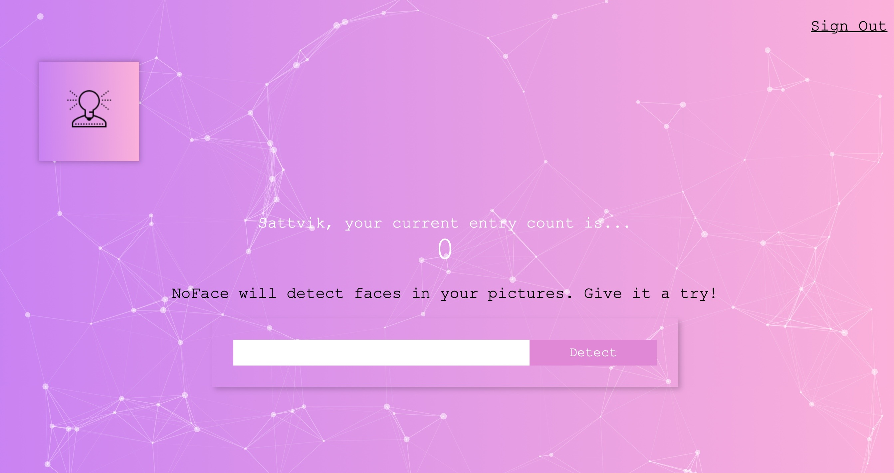
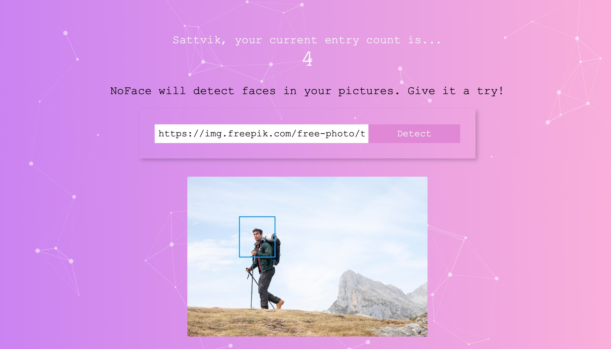

# NoFace

## 🚀 About Me

NoFace is a responsive full stack face detection application. NoFace will detect faces in any image URL provided to it.

## Screenshots





## Run Locally

Clone the project

```bash
  git clone https://github.com/sttvk/noface.git
  git clone https://github.com/sttvk/noface-api.git
```

Go to the project directory

```bash
  cd noface
```

Install dependencies

```bash
  npm install
```

Start the server

```bash
  npm run start
```

## Credits

[The Complete Web Developer in 2022: Zero to Mastery](https://www.udemy.com/course/the-complete-web-developer-zero-to-mastery/learn/lecture/8803510?start=0#overview)
